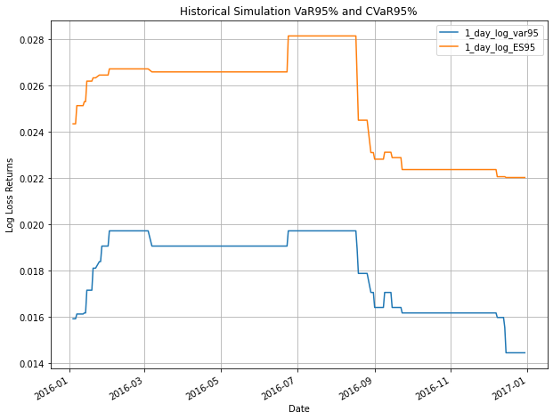
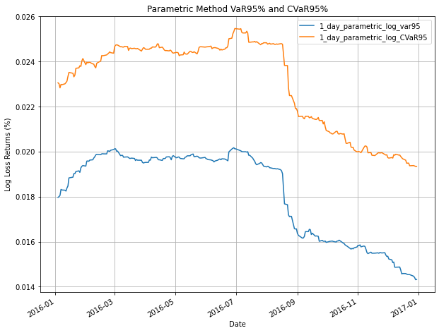
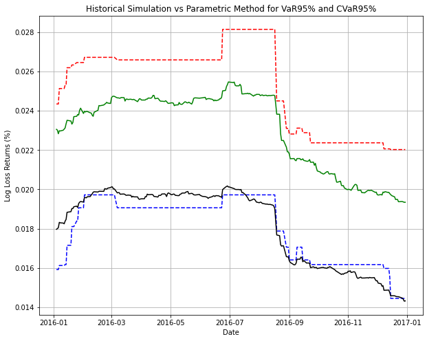

# Treehouse_Finance_test
For technical assessment

## Q1.
 - a. Sally, Joe and Dan have salaries greater than their immediate managers
 - b. Average salary of employees who do not manage anyone: $425.0

## Q2. 
Python would not be able to run if there is uninitialized variables, it will throw a NameError exception during runtime and hence the function "exists" would not be called.

	solution:
	1. Use Try-Except to catch NameError (undefined variables)
	2. If NameError exception is raised: set the variable to None then pass into function "exists"
	3. Then using the function to print result whether the variable is defined or undefined.

## Q3. 
    Each number on the Pascal's triangle is a number combination of N take r.
    N is the row number starting from 0; r is the nth number of row N, starting from 0

    1               0C0
    1 1         ->  1C0  1C1
    1 2 1           2C0  2C1  2C2
    1 3 3 1         3C0  3C1  3C2  3C3
    ..........

    NCr formula: N! / [(N-r)!*r!]

    Write function createPascal(N) which takes N rows
    for each row, (start from 0 to N-1)
        for each number,r, (there is 1 to N inclusive numbers)
            print each value of NCr and add end=" " to add a space between each number
        
        print() to start printing on new line for next row
    ------------------------------------------------------------------------------------------
    Runtime: O(N^2)

## Q4.
- ai. The VaR95% of portfolio as of 2016/12/31 is 0.01445269661722914 (14.45%) log return loss or 0.014557641807815047 (14.56%) simple return loss for 95% confidence.
- aii. The CVaR95% or Expected Shortfall of portfolio as of 2016/12/31 is 2.202% log return loss or 2.227% simple return loss for 95% confidence.
  

- bi. The VaR95% of portfolio using Parametric method as of 2016/12/31 1.44% log return loss for 95% confidence.
- bii. The CVaR95% or Expected Shortfall calculated using Parametric method is 19.34% log return loss or 19.53% simple return loss for 95% confidence.
  

### Overall comparison:
  

- c. 
	Assumptions:
	- Shorting allowed
	- No leverage (Sum of weights = 1)
	- No transaction fees
	- Objective Function: Minimize Risk and Maximize Returns

- Find the optimal portfolio which we define as the highest Sharpe ratio (Minimize Variance and Maximize returns) across 4 different strategies
    - 1. Long-only with constraint (single stock <= 50% of portfolio)
    - 2. Long-only without constraint
    - 3. Long-short with constraint
    - 4. Long-short without constraint

- Potential issues to take note:
    - 1. Overexposure to single stock is risky (single stock <= 50% of portfolio)
    - 2. We are ignoring transaction fees for rebalancing portfolio
    - 3. We can also consider only minimizing risk (variance) only

-------------------- Month 1 --------------------
| Jan  | % holdings |
|------|------------|
| AAPL | -0.00      |
| IBM  | 0.41       |
| GOOG | -0.00      |
| BP   | 0.00       |
| XOM  | 0.00       |
| COST | 0.59       |
| GS   | -0.00      |

-------------------- Month 2 --------------------
| Feb  | % holdings |
|------|------------|
| AAPL | -0.13      |
| IBM  | 0.07       |
| GOOG | 0.38       |
| BP   | -0.16      |
| XOM  | 0.50       |
| COST | 0.18       |
| GS   | 0.16       |

-------------------- Month 3 --------------------
| Mar  | % holdings |
|------|------------|
| AAPL | 0.01       |
| IBM  | 0.26       |
| GOOG | 0.01       |
| BP   | -0.09      |
| XOM  | 0.33       |
| COST | 0.39       |
| GS   | 0.09       |

-------------------- Month 4 --------------------
| Apr  | % holdings |
|------|------------|
| AAPL | 0.04       |
| IBM  | 0.05       |
| GOOG | 0.10       |
| BP   | -0.00      |
| XOM  | 0.65       |
| COST | 0.16       |
| GS   | -0.00      |

-------------------- Month 5 --------------------
| May  | % holdings |
|------|------------|
| AAPL | 0.21       |
| IBM  | 0.16       |
| GOOG | 0.22       |
| BP   | -0.14      |
| XOM  | 0.50       |
| COST | 0.07       |
| GS   | -0.01      |

-------------------- Month 6 --------------------
| Jun  | % holdings |
|------|------------|
| AAPL | 0.18       |
| IBM  | 0.27       |
| GOOG | 0.03       |
| BP   | -0.14      |
| XOM  | 0.42       |
| COST | 0.50       |
| GS   | -0.25      |

-------------------- Month 7 --------------------
| Jul  | % holdings |
|------|------------|
| AAPL | 0.09       |
| IBM  | 0.50       |
| GOOG | 0.20       |
| BP   | -0.09      |
| XOM  | 0.38       |
| COST | 0.21       |
| GS   | -0.29      |

-------------------- Month 8 --------------------
| Aug  | % holdings |
|------|------------|
| AAPL | 0.10       |
| IBM  | 0.17       |
| GOOG | 0.23       |
| BP   | 0.07       |
| XOM  | 0.12       |
| COST | 0.25       |
| GS   | 0.05       |

-------------------- Month 9 --------------------
| Sept | % holdings |
|------|------------|
| AAPL | 0.04       |
| IBM  | 0.25       |
| GOOG | 0.50       |
| BP   | -0.08      |
| XOM  | 0.22       |
| COST | 0.21       |
| GS   | -0.14      |

-------------------- Month 10 --------------------
| Oct  | % holdings |
|------|------------|
| AAPL | 0.12       |
| IBM  | 0.28       |
| GOOG | 0.04       |
| BP   | 0.37       |
| XOM  | -0.22      |
| COST | 0.45       |
| GS   | -0.05      |

-------------------- Month 11 --------------------
| Nov  | % holdings |
|------|------------|
| AAPL | 0.21       |
| IBM  | 0.13       |
| GOOG | -0.07      |
| BP   | -0.11      |
| XOM  | 0.48       |
| COST | 0.34       |
| GS   | 0.03       |

-------------------- Month 12 --------------------
| Dec  | % holdings |
|------|------------|
| AAPL | 0.20       |
| IBM  | 0.09       |
| GOOG | 0.11       |
| BP   | 0.31       |
| XOM  | 0.11       |
| COST | 0.06       |
| GS   | 0.12       |

## Q5a. Find number of python files
###	Solution:
Traverse through the folder to find files ending with '.py'. We will not consider .ipynb files in this case. However, if you would like to include counting '.ipynb' files, simply add "file.endswith('.ipynb').

## Q5b. Find number of comments and code in all python files 
###	Solution:
Each file that we traverse that matches ".py", we will iterate through each line
Some important things to consider:
1. Indented Code vd Indented block comments
2. Empty line ("     ") vs New line (\n)
3. re.readlines will ignore last line if it is not followed by a newline. Hence we do not use re.readlines
4. We will consider inline comments after the line of code as a line of code.
	i.e for i in range(10): # iterates 10 times, i takes value [0,9]
        
    Assumption:
        1. We do not count empty/new lines in block comments
        2. We do not count inline comments that are written after the line of code
            i.e print('hello world') #this prints the string "hello world" will be considered as a line of code

## Q5c. Find numbr of functions defined
###	Solution: 
Together with 5a and 5b. If it is an indented/non-indented code, check if it starts with "def".
		
Assumption:
1. We will ignore lambda(anonymous) functions. 

## Q5d. Find the number of line changes from current version against HEAD~3 (3 generations earlier)

## Q5e. Find file size down to 2-level depth

Using the original iteration, check the current depth and sum the size of each folder.

## Q6.   
Method 1: using datefinder
    Input txtfile into function findDates
    datefinder will be able to find all occurrences of dates with different
    date formats in a text.

    Problem: 
        Misread fractions as dates i.e 1/4, 3/4, 5/8 as 1st april 2021, 3rd april 2021, 5th august 2021
        Other characters that are very similar to date formats like 1st, 2nd, 3rd etc.
    Solution: 
        Pre-process textfile to remove all fractions and ordinal numbers
